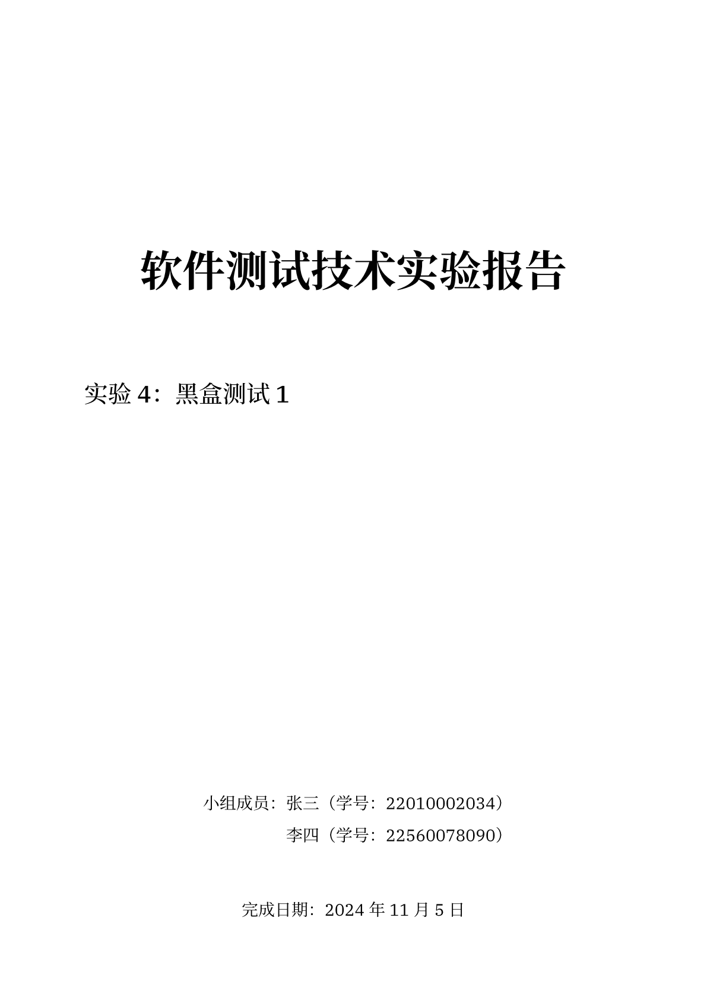
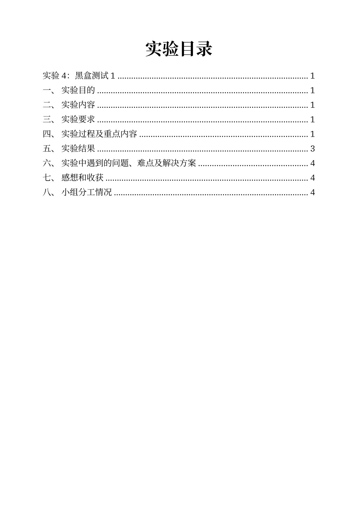
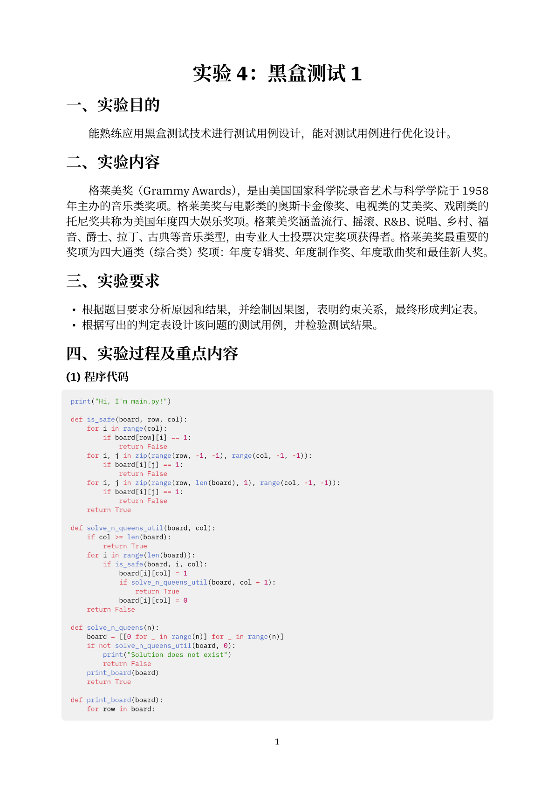

# 非官方 OUC 计算机实验报告 Typst 模板

**本仓库非官方，使用者需自行承担风险。** 本仓库提供了一些自制的适用于中国海洋大学计算机学院实验报告的 Typst 模板。

> [!IMPORTANT]  
> 对于不熟悉 Typst 的用户，建议通过 [typst 中文社区导航](https://typst-doc-cn.github.io/guide/) 和 [小蓝书 Web 版](https://typst-doc-cn.github.io/tutorial/) 了解 Typst 的基本使用方法。
> 一言以蔽之，使用 Typst，你可以像写 Markdown 一样写 LaTeX 风格的文档。

## 使用方法

- 安装 typst-cli 或使用官方的在线编辑器。（[参考此页](https://typst-doc-cn.github.io/tutorial/introduction.html)，只需花费几分钟）
- 下载模板文件 `template.typ`，将其放置在你的实验报告文件夹中。
- 在实验报告的开头使用 `#import "../template.typ": *` 导入模板。
- 见各个实验报告的 `example.typ` 文件以了解如何填入需要的参数。

> [!TIP]
> 建议对于一门课程的实验报告，只使用一个文件夹，将模板放在根目录、实验报告放在子目录中以便管理。

> [!NOTE]  
> 由于作者比较喜欢 [Noto Serif CJK SC](https://github.com/notofonts/noto-cjk) 和 [IBM Plex 系列](https://github.com/IBM/plex) 字体，对于大部分模板，这两个字体是默认的。如果你没有安装这两个字体，可以在模板中将字体设置为你喜欢的字体（使用 `typst fonts` 查看当前可用字体）或者通过超链接下载这些字体。

## 快速跳转

`template.typ` 文件和 `example.pdf` 文件均位于各个文件夹中。

- 数据库系统：[template.typ](数据库系统/template.typ) | [PDF 示例](数据库系统/example/main.pdf)

    | 预览 |
    |--|
    |  |

- 软件测试技术 / 编译原理：[template.typ](软件测试技术/template.typ) | [PDF 示例](软件测试技术/example/main.pdf) | [其余页面预览](assets/软件测试技术)

    | 封面 | 目录 | 正文 |
    |--|--|--|
    |  |  |  |
